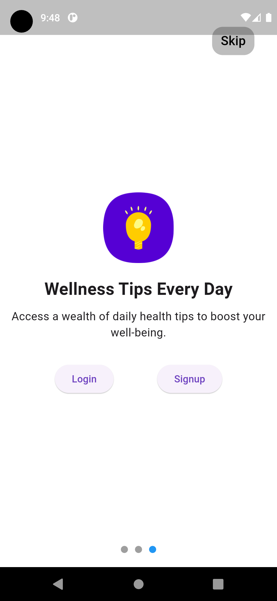

# We Care

## Overview

"We Care" is a Flutter-based mobile application designed with the well-being of senior citizens in mind. The app aims to provide a sense of safety and support for the elderly, offering features like Firebase authentication, SOS calling, medicine reminders, and daily health tips.

## Features

### 1. Firebase Authentication

- **Login and Signup:** Secure authentication using Firebase allows users to create accounts and log in securely.

### 2. SOS Calling

- **Emergency Contact Setup:** Users can select emergency contacts during the registration process.
- **Quick SOS Call:** In case of an emergency, a simple click on the SOS button launches a call to the pre-configured emergency contact.

### 3. Medicine Reminder

- **Personalized Reminders:** Set up medication schedules for personalized medicine reminders.
- **Notifications:** Receive timely notifications to ensure medications are taken on schedule.

### 4. Health Tips

- **Daily Tips:** Access a repository of daily health tips to promote well-being and a healthy lifestyle.

## Screenshots

<div align="center">
  
  
  
    
  
  
    
  
  
    
  
  
  
</div>

## Technologies Used

- **Flutter:** The app is developed using the Flutter framework for a smooth cross-platform experience.
- **Firebase:** Firebase is utilized for secure authentication and user data storage.

## How to Use

1. **Clone the Repository:**
    ```bash
    git clone https://github.com/your-username/WeCare.git
    ```

2. **Setup Flutter:**
    - Ensure Flutter is installed. If not, follow the [Flutter Installation Guide](https://flutter.dev/docs/get-started/install).

3. **Firebase Configuration:**
    - Create a Firebase project on the [Firebase Console](https://console.firebase.google.com/).
    - Set up authentication and update the configuration in the app.

4. **Run the App:**
    ```bash
    cd WeCare
    flutter run
    ```

## Contributors

- Sumit Banwakade (@Sumit4482)

## License

This project is licensed under the [MIT License](LICENSE.md).
